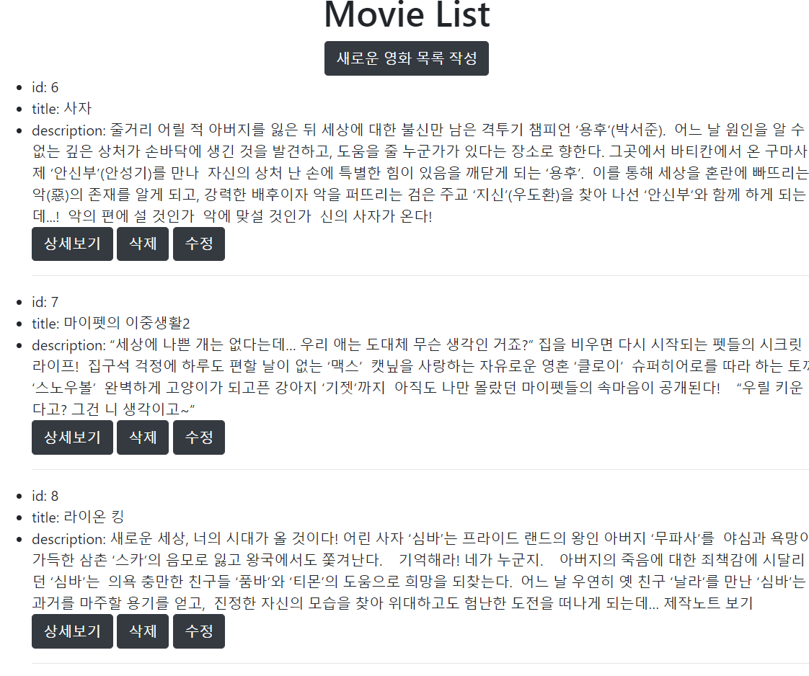
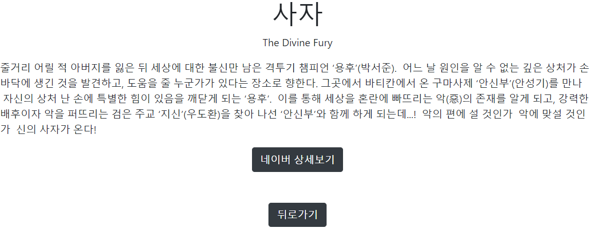
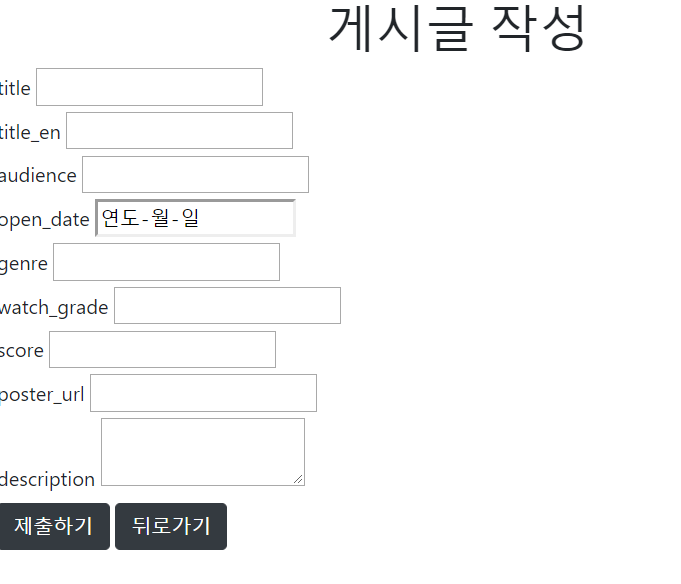

## Project_05: 

## Django

`python 3.7`

[TOC]


#### Overview

Django handling을 goals에 따라 한다.


#### Requirements

1. (필수) Python Web Framework - Django
2. (필수) Python Web Framework 사용을 위한 환경 설정
가상환경 Python 3.7

3. (선택) 샘플 영화 정보
예시 영화 Input인 `data.csv` 가 있습니다.

#### Goal

데이터를 생성, 조회, 삭제, 수정할 수 있는 Web Application 제작
Python Web Framework를 통한 데이터 조작
Object Relational Mapping에 대한 이해
Template Variable을 활용한 Template 제작
영화 추천 사이트의 영화 정보 데이터 관리

#### Development Method


views.py

```python
from django.shortcuts import render
from .models import Movie

# Create your views here.

# 영화목록 
def movielist(request):
    movielist = Movie.objects.all()
    context = {
        'movielist': movielist,
    }
    return render(request, 'movies/movielist.html', context)

# 영화 정보 Form 생성
def new(request):
    return render(request, 'movies/new.html')

# 영화 정보 DB 저장
def create(request):
     # 사용자가 form 에서 전달한 정보를 꺼낸다
    title = request.GET.get('title')
    title_en = request.GET.get('title_en')
    audience = request.GET.get('audience')
    open_date = request.GET.get('open_date')
    genre = request.GET.get('genre')
    watch_grade = request.GET.get('watch_grade')
    score = request.GET.get('score')  
    poster_url = request.GET.get('poster_url')  
    description = request.GET.get('description') 


    # 해당 정보를 Movie 모델을 이용하여 새롭게 데이터를 저장한다.
    movie = Movie()

    movie.title = title
    movie.title_en = title_en
    movie.audience = audience
    movie.open_date = open_date
    movie.genre = genre
    movie.watch_grade = watch_grade
    movie.score = score
    movie.poster_url = poster_url
    movie.description = description

    movie.save()
    # 사용자에게 저장이 완료되었다는 페이지를 보여준다.
    return render(request, 'movies/create.html')

def detail(request, movie_pk): # pk를 받은 것
    movies = Movie.objects.filter(pk=movie_pk)
    context = {
        'movies': movies,
    }
    return render(request, 'movies/detail.html', context)

def delete(request, movie_pk):
    movies = Movie.objects.filter(pk=movie_pk)
    movies.delete()
    return render(request, 'movies/delete.html')

def update(request, movie_pk):
    movie = Movie.objects.get(pk=movie_pk)
    movie.title = request.GET.get('title')
    movie.title_en = request.GET.get('title_en')
    movie.audience = request.GET.get('audience')
    movie.open_date = request.GET.get('open_date')
    movie.genre = request.GET.get('genre')
    movie.watch_grade = request.GET.get('watch_grade')
    movie.score = request.GET.get('score')  
    movie.poster_url = request.GET.get('poster_url')  
    movie.description = request.GET.get('description') 
    movie.save()

    context = {
        'title': movie.title
    }
    
    return render(request, 'movies/update.html', context)

def edit(request, movie_pk):
    context = {
        'movie_pk': movie_pk
    }

    return render(request, 'movies/edit.html', context)
```


### 영화목록

movielist.html

```html

 Movie List 

 

<div class="container"> 
<h1 class="text-center">Movie List</h1>
</div>  

<div class="d-flex justify-content-center">
<a href="/movies/new/" class="btn btn-dark">새로운 영화 목록 작성</a>
</div>

<div>
<ul>
 
<li>id: {{ movie.id }}</li>
<li>title: {{ movie.title }} </li>
<li>description: {{ movie.description }}</li>
<a href="/movies/{{ movie.id }}/" class="btn btn-dark">상세보기</a>
<a href="/movies/{{ movie.id }}/delete/" class="btn btn-dark">삭제</a>
<a href="/movies/{{ movie.id }}/edit/" class="btn btn-dark">수정</a>
<hr>

</ul>
</div>



```





### 영화 상세보기

detail.html

```html



Detail



<div >


<h1 class="d-flex justify-content-center">{{ movie.title }}</h1>
<p class="d-flex justify-content-center"> {{ movie.title_en }}</p>
<p class="d-flex justify-content-center"> {{ movie.description }}</p> 

<div class="d-flex justify-content-center">
<a href="{{ movie.poster_url }}" class="btn btn-dark">네이버 상세보기</a>
</div>

<div class="d-flex justify-content-center m-5">
<a href="/movies/" class="btn btn-dark">뒤로가기</a>
</div>


</div>

```





### 추가하기

new.html

```html






<h1 class="text-center">게시글 작성</h1>
<form action="/movies/create/">

<label for="title">title</label>
<input id="title" type="text" name="title"><br>

<label for="title_en">title_en</label>
<input id="title_en" type="text" name="title_en"></input><br>

<label for="audience">audience</label>
<input id="audience" type="number" name="audience"></input><br>

<label for="open_date">open_date</label>
<input id="open_date" type="date" name="open_date"></input><br>

<label for="genre">genre</label>
<input id="genre" type="text" name="genre"></input><br>

<label for="watch_grade">watch_grade</label>
<input id="watch_grade" type="text" name="watch_grade"></input><br>

<label for="score">score</label>
<input id="score" type="float" name="score"></input><br>

<label for="poster_url">poster_url</label>
<input id="poster_url" type="text" name="poster_url"></input><br>

<label for="description">description</label>
<textarea id="description" type="text" name="description"></textarea><br>

<button type="submit" class="btn btn-dark">제출하기</button>
<a href="/movies/" class="btn btn-dark">뒤로가기</a>
</form>

```


create.html

```html






<h1 class="text-center">저장완료</h1>
<p class="text-center">
<a href="/movies/" class="btn btn-dark">Movie List</a>
</p>

```




### 수정하기

edit.html

```html






<h1 class="text-center">게시글 작성</h1>
<form action="/movies/{{ movie_pk }}/update/">

<label for="title">title</label>
<input id="title" type="text" name="title"><br>

<label for="title_en">title_en</label>
<input id="title_en" type="text" name="title_en"></input><br>

<label for="audience">audience</label>
<input id="audience" type="number" name="audience"></input><br>

<label for="open_date">open_date</label>
<input id="open_date" type="date" name="open_date"></input><br>

<label for="genre">genre</label>
<input id="genre" type="text" name="genre"></input><br>

<label for="watch_grade">watch_grade</label>
<input id="watch_grade" type="text" name="watch_grade"></input><br>

<label for="score">score</label>
<input id="score" type="float" name="score"></input><br>

<label for="poster_url">poster_url</label>
<input id="poster_url" type="text" name="poster_url"></input><br>

<label for="description">description</label>
<textarea id="description" type="text" name="description"></textarea><br>

<button type="submit" class="btn btn-dark">수정하기</button>
<a href="/movies/" class="btn btn-dark">뒤로가기</a>
</form>

```


update.html

```html






<h1 class="text-center">{{ title }}수정완료</h1>

<a href="/movies/" class="btn btn-dark">뒤로가기</a>
</form>

```


### 삭제하기

delete.html

```html






<h1 class="text-center">삭제완료</h1>
<p class="text-center">
<a href="/movies/" class="btn btn-dark">Movie List</a>
</p>

```


### Data 자동저장

```python
import requests
from pprint import pprint
from datetime import datetime, timedelta
from decouple import config
import csv
import time

with open('data2.csv', 'r', newline='', encoding='utf-8') as f:
    reader = csv.DictReader(f)
    for row in reader:
        title = row['movieNm']
        title_en = row['movieNmEn']
        audience = row['audiAcc']
        open_date = row['openDt']
        genre = row['GenreNm']
        watch_grade = row['watchGradeNm']
        score = row['Score']
        poster_url = row['Naver']
        description = row['Description']

        save = 'http://127.0.0.1:8000/movies/create/'
        query = f'?title={title}&title_en={title_en}&audience={audience}&open_date={open_date}&genre={genre}&watch_grade={watch_grade}&score={score}&poster_url={poster_url}&description={description}'
        response = requests.get(save+query)
```

