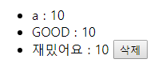

# Project_07: 

## Accounts App

유저의 회원가입과 로그인, 로그아웃 기능을 구현해야 합니다.

1. ##### 유저 목록 ( /accounts/ ) 
   
   1.  사용자의 목록이 나타나며, 사용자의 username 을 클릭하면 유저 상세보기 페이지로 넘어 갑니다. 
   
   
   
   
   
   
2. ##### 유저 상세보기 (/accounts/{user_pk}/ ) 
   
   1.  해당 유저가 작성한 평점 정보가 모두 출력됩니다.
   2.  해당 유저가 좋아하는 영화 정보가 모두 출력됩니다. 
   3.  각각 평점을 수정할 수 있도록 구성합니다. 
   
   
      
   
   

## Movies App

1. ##### 영화 상세보기 (/movies/{movie_pk})
   
   1.  로그인 한 사람만 영화 평점을 남길 수 있습니다.
2.  모든 사람은 평점 목록을 볼 수 있습니다.
    
   
   - ###### 로그인
   
     
   
   - ###### 비로그인
   
     
   
     
   
2. ##### 영화 생성 (/movies/)
   
1.  로그인 한 사람만 영화를 생성할 수 있습니다.
    
   
   - ###### 로그인
   
     
   
   - ###### 비로그인
   
     
   
   
   
4. ##### 평점 삭제
   
1.  평점 삭제는 본인만 가능합니다.
    
   
   - ###### 로그인
   
     
   
   - ###### 비로그인
   
     
   
   
   
   
   
4. ##### 영화 좋아요 기능 구현

   1.  좋아하는 영화를 담아 놓을 수 있도록 구현합니다.
   2.  로그인 한 유저만 해당 기능을 사용할 수 있습니다.
   3.   영화 좋아요 URL은 POST /movies/1/like/ 등 이며, 동적으로 할당되는 부분이 존재합니다. 동적으로 할당되는 부분에는 데이터베이스에 저장된 영화 정보의 Primary Key가 들어갑니다.
   4.  적합한 위치에 좋아요 링크를 생성합니다.
   5.  영화가 존재 하지 않는 경우 404 페이지를 보여줍니다.
   

   - ###### 좋아요

     .PNG)

   - ###### 좋아요 취소

     .PNG)

   - ###### 비로그인

     

   
   