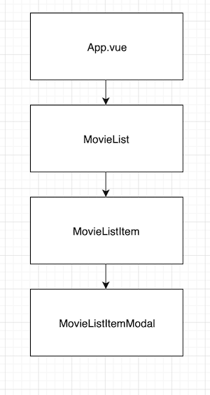

# Project_08: 


### 목표

Node 개발 환경과 webpack에 대한 이해
컴포넌트 기반의 구조에 대한 이해
axios를 통한 비동기적 데이터 처리에 대한 이해
Vue.js 개발 프로세스를 통한 영화 목록 페이지 구현


### 준비 사항

Node 개발 환경 12.x, Vue 2.x


### 요구 사항

props의 component 관계



# movie

## Project setup

```
npm install
```

### Compiles and hot-reloads for development

package.json의 scripts를 실행

```
npm run serve
```

### Compiles and minifies for production

```
npm run build
```

### Lints and fixes files

```
npm run lint
```


### 데이터 요청 URL

 https://gist.githubusercontent.com/edujason-hphk/f57d4cb915fcec433ece535b2f08a10f/raw/612fd3f00468722ead2cfe809f14e38230b47686/movie.json 

 https://gist.githubusercontent.com/edujason-hphk/eea9c85a937cbf469b8f55fd7f8524df/raw/68bad38a2bc911d3a39bce26d6dd9b68a7efe849/genre.json 

### 개발순서

axios로 요청

App.vue

```vue
<template>
  <div id="app">
    <div class="container">
      <!-- 1-3. 호출하시오. 
        필요한 경우 props로 데이터를 보내줍니다.
      -->
      <MovieList v-bind:movies="movies" v-bind:genres="genres"/>
      

    </div>
  </div>
</template>

<script>
// 1-1. 저장되어 있는 MovieList 컴포넌트를 불러오고,
import MovieList from './components/movies/MovieList.vue'
// import MovieListItem from './components/movies/MovieListItem.vue'
const axios = require('axios');

export default {
  name: 'app',
  // 1-2. 아래에 등록 후
  components: {
    MovieList: MovieList,
    // MovieListItem: MovieListItem,
  },
  data() {
    return {
      // 활용할 데이터를 정의하시오.
      movies: [],
      genres: [],
    }
  },
  mounted() {
    // 0. mounted 되었을 때, 
    // 1) 제시된 URL로 요청을 통해 data의 movies 배열에 해당 하는 데이터를 넣으시오. 
    axios.get('https://gist.githubusercontent.com/edujason-hphk/f57d4cb915fcec433ece535b2f08a10f/raw/612fd3f00468722ead2cfe809f14e38230b47686/movie.json')
    .then(response => this.movies = response.data)
    // 2) 제시된 URL로 요청을 통해 data의 genres 배열에 해당 하는 데이터를 넣으시오.
    axios.get('https://gist.githubusercontent.com/edujason-hphk/eea9c85a937cbf469b8f55fd7f8524df/raw/68bad38a2bc911d3a39bce26d6dd9b68a7efe849/genre.json')
    .then(response => this.genres = response.data)
    // axios는 위에 호출되어 있으며, node 설치도 완료되어 있습니다.
  },
}

</script>

<style>
#app {
  font-family: 'Avenir', Helvetica, Arial, sans-serif;
  -webkit-font-smoothing: antialiased;
  -moz-osx-font-smoothing: grayscale;
  text-align: center;
  color: #2c3e50;
  margin-top: 60px;
}
</style>
```


MovieList.vue
```vue
<template>
  <div>
    <h1>영화 목록</h1>
    <h2>장르 선택</h2>
    
    <!-- 2. 장르 선택(제일 마지막에 구현하시오.)
    2-1. App 컴포넌트로 부터 받은 genres를 반복하여 드롭다운을 완성 해주세요.
    
    2-2. 드롭다운은 selectedGenreId data와 양방향바인딩(v-model)이 됩니다.
    
    2-3. 값 변경이 되면, 특정한 함수를 실행 해야합니다.
     -->

    
    <select class="form-control">
      <option>
       
      </option>
    </select>

    <div class="row mt-5">
    <!-- 1-3. 반복을 통해 호출하시오. 
            필요한 경우 props를 데이터를 보내줍니다.
          -->
          <!-- (나중에 마지막으로) selectedGenreId 값에 따른 분기를 해야 합니다.
          -->
    <MovieListItem v-for="movie in movies" v-bind:key="movie.id" v-bind:movie="movie"/>
    </div>
  </div>
</template>

<script>
// 1-1. 저장되어 있는 MovieListItem 컴포넌트를 불러오고,
import MovieListItem from './MovieListItem.vue'

export default {
  name: 'MovieList',
  // 1-2. 아래에 등록 후

  components: {
    MovieListItem : MovieListItem
  },

  // App에서 받은 데이터를 사용하기 위해서 이와 같이 등록
  props: {
    movies: Array,
    genres: Array,
  },

  data () {
    return {
      // 활용할 데이터를 정의하시오.
      movies: [],
      genres: [],
    }
  },
  // 0. props 데이터를 받이 위하여 설정하시오.
  // genres와 movies 모두 타입은 array이며, 필수입니다.
  // 설정이 완료 되었다면, 상위 컴포넌트에서 값을 넘겨 주세요.
  // 그리고 적절한 곳에 사용하세요.

  // 2-3.에서 이야기하는 특정한 함수는 selectedGenreId의 값이 변경될 때마다 호출 됩니다.
  // 드랍다운에서 장르를 선택하면, 해당 영화들만 보여주도록 구현 예정입니다.
  // 주의할 것은 직접 부모 컴포넌트의 데이터를 변경할 수 없다는 점입니다.
  // 완료 후 
}
</script>

<style>
select {
  display: block;
  width: 50% !important;
  margin: 2rem auto !important;
}
</style>
```


MovieListItem.vue

```vue
<template>
  <div class="col-3 my-3">
    <!-- img 태그에 src와 alt값(영화제목)을 설정하시오 -->
    
    <!-- 영화 제목을 출력하시오. -->
    <h3>{{ movie.name }}</h3>
    <!-- 모달을 활용하기 위해서는 data-taget에 모달에서 정의된 id값을 넣어야 합니다. -->
    <!-- bootstrap option 따라한거라고 생각하면된다. -->
    <button class="btn btn-primary" data-toggle="modal" v-bind:data-target="`#movie-${movie.id}`">영화 정보 상세보기</button>
    <!-- 1-3. 호출하시오.
      필요한 경우 props를 데이터를 보내줍니다.
      -->
    <movieListItemModal v-bind:key="movie.id" v-bind:movie="movie"/>

  </div>
</template>

<script>
// 1-1. 저장되어 있는 MovieListItemModal 컴포넌트를 불러오고,
import MovieListItemModal from './MovieListItemModal.vue'

export default {
  name: 'MovieListItem',
  // 1-2. 아래에 등록 후
  components: {
    MovieListItemModal: MovieListItemModal,
  },
  // 0. props 데이터를 받기 위하여 설정하시오.
  props: {
    movie: Array
  },
  // movie 타입은 Object이며, 필수입니다.
  // 설정이 완료 되었다면, 상위 컴포넌트에서 값을 넘겨 주세요.
  // 그리고 적절한 곳에 사용하세요.

  data () {
    // 활용할 데이터를 정의하시오.
  }
}
</script>

<style>
.movie--poster {
  width: 200px;
}
</style>
```


MovieListItemModal.vue

```vue
<template>
<!-- vue 콘솔에서 확인하여, 추가 정보들도 출력하세요. -->
<!-- 고유한 모달을 위해 id 속성을 정의하시오. 예) movie-1, movie-2, ... -->
<div class="modal fade" tabindex="-1" role="dialog" v-bind:id="`movie-${movie.id}`">
  <div class="modal-dialog" role="document">
    <div class="modal-content">
      <div class="modal-header">
        <!-- 영화 제목을 출력하세요. -->
        <h5 class="modal-title" >{{ movie.name }}</h5>
        <button type="button" class="close" data-dismiss="modal" aria-label="Close">
          <span aria-hidden="true">&times;</span>
        </button>
      </div>
      <div class="modal-body">
        <!-- 영화 설명을 출력하세요. -->
        <p>{{ movie.description }}</p>
      </div>
      <div class="modal-footer">
        <button type="button" class="btn btn-secondary" data-dismiss="modal">Close</button>
      </div>
    </div>
  </div>
</div>
</template>

<script>

export default {
  name: 'movie-list-item-modal',
  // 0. props 데이터를 받이 위하여 설정하시오.
  // movie 타입은 Array, 필수입니다.
  // 설정이 완료 되었다면, 상위 컴포넌트에서 값을 넘겨 주세요.
  // 그리고 적절한 곳에 사용하세요.
  props: {
    movie: Array,
  },
}
</script>

<style>

</style>
```

